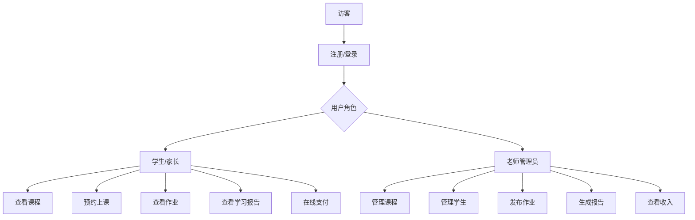
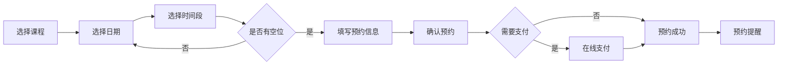
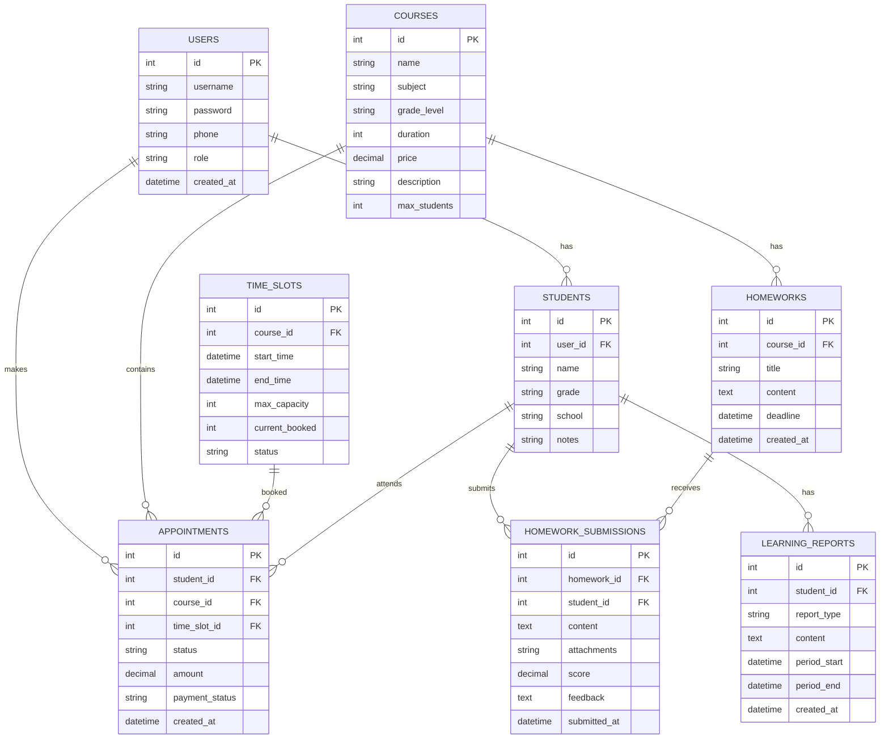
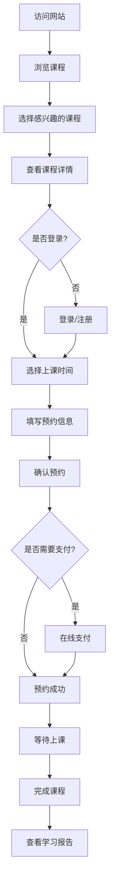
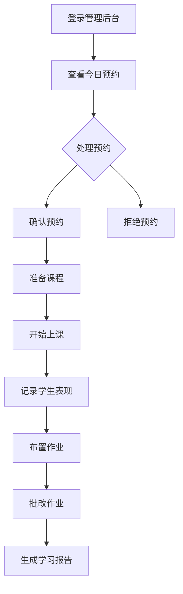

# 课外培训约课网站设计方案

## 项目概述

为学科类课外培训老师设计一个约课网站，支持数学、英语、语文等课程的在线预约、学生管理、在线支付、作业管理和学习报告功能。目标用户规模50人以内，以简单易用为主。

---

## 一、网站核心信息架构

### 1.1 首页展示信息
- **老师介绍**：个人简介、教学经验、教育背景、教学理念
- **课程概览**：提供的课程类型、适合年级、课程特色
- **教学成果**：学生进步案例、荣誉证书、家长评价
- **快速预约入口**：醒目的预约按钮
- **联系方式**：微信、电话、地址

### 1.2 课程信息
- **课程名称**：如"初中数学提高班"、"小学英语启蒙"
- **适合年级**：小学1-6年级、初中1-3年级等
- **课程时长**：每节课时长（如45分钟、90分钟）
- **课程形式**：一对一、小班课（2-4人）、大班课
- **收费标准**：按课时收费、按学期收费
- **课程大纲**：教学内容安排
- **上课地点**：线上/线下地址

### 1.3 老师信息
- **基本信息**：姓名、照片、教龄
- **教育背景**：毕业院校、专业、学历
- **教学资质**：教师资格证、获奖情况
- **教学风格**：教学特点描述
- **成功案例**：学生进步案例

---

## 二、功能模块设计

### 2.1 用户系统

#### 学生/家长端功能
- 注册登录（手机号/微信登录）
- 个人信息管理
- 孩子信息管理（可添加多个孩子）
- 预约记录查看
- 学习进度查看

#### 老师管理端功能
- 课程管理（增删改查）
- 时间段管理（可预约时间设置）
- 学生管理
- 预约审核/确认
- 数据统计

### 2.2 预约系统

#### 预约功能特点
- **日历视图**：直观展示可预约日期
- **时间段选择**：显示可用/已满状态
- **预约限制**：
  - 每个时间段人数限制
  - 提前预约时间限制（如需提前24小时）
  - 取消预约时间限制
- **预约状态**：待确认、已确认、已完成、已取消
- **预约提醒**：短信/微信通知

### 2.3 在线支付系统

#### 支付方式
- 微信支付
- 支付宝支付
- 银行转账（线下支付确认）

#### 支付流程
1. 选择课程和时间段
2. 确认订单信息
3. 选择支付方式
4. 完成支付
5. 生成预约记录

#### 退款规则
- 提前24小时取消：全额退款
- 提前12小时取消：退还50%
- 12小时内取消：不退款

### 2.4 作业管理系统

#### 作业发布
- 关联课程/学生
- 作业内容（支持富文本、图片、附件）
- 截止日期
- 作业要求说明

#### 作业提交
- 学生在线提交
- 支持文字、图片、文件
- 提交时间记录

#### 作业批改
- 在线批注
- 评分（百分制/等级制）
- 评语反馈
- 批改记录保存

### 2.5 学习报告系统

#### 报告内容
- **学习进度**：课程完成情况
- **出勤统计**：出勤率、迟到早退记录
- **作业分析**：完成率、平均分、进步趋势
- **知识点掌握**：各知识点掌握程度
- **老师评语**：阶段性评价和建议

#### 报告生成
- 自动生成周报/月报
- 支持PDF导出
- 分享给家长

---

## 三、页面规划

### 3.1 公开页面
| 页面 | 路由 | 说明 |
|------|------|------|
| 首页 | / | 网站门户，展示核心信息 |
| 课程列表 | /courses | 所有课程展示 |
| 课程详情 | /courses/:id | 单个课程详细信息 |
| 老师介绍 | /teacher | 老师个人介绍 |
| 登录/注册 | /login, /register | 用户认证 |

### 3.2 学生/家长页面
| 页面 | 路由 | 说明 |
|------|------|------|
| 个人中心 | /dashboard | 概览信息 |
| 预约课程 | /booking | 选择课程和时间 |
| 我的预约 | /appointments | 预约记录管理 |
| 我的作业 | /homework | 作业列表和提交 |
| 学习报告 | /reports | 学习情况报告 |
| 个人设置 | /settings | 账户设置 |

### 3.3 管理后台页面
| 页面 | 路由 | 说明 |
|------|------|------|
| 管理首页 | /admin | 数据概览 |
| 课程管理 | /admin/courses | 课程CRUD |
| 时间管理 | /admin/schedule | 可预约时间设置 |
| 学生管理 | /admin/students | 学生信息管理 |
| 预约管理 | /admin/appointments | 预约审核和处理 |
| 作业管理 | /admin/homework | 作业发布和批改 |
| 财务管理 | /admin/finance | 收入统计 |
| 报告管理 | /admin/reports | 生成学习报告 |

---

## 四、数据库设计

### 4.1 核心数据表

### 4.2 数据表说明

| 表名 | 说明 |
|------|------|
| users | 用户表，存储登录信息 |
| students | 学生表，存储学生详细信息 |
| courses | 课程表，存储课程信息 |
| time_slots | 时间段表，存储可预约时间 |
| appointments | 预约表，存储预约记录 |
| homeworks | 作业表，存储作业内容 |
| homework_submissions | 作业提交表 |
| learning_reports | 学习报告表 |
| payments | 支付记录表 |

---

## 五、技术栈推荐

### 5.1 前端技术
- **框架**：Vue 3 + Vite（轻量、易上手）
- **UI组件库**：Element Plus（成熟、文档完善）
- **状态管理**：Pinia
- **路由**：Vue Router
- **HTTP请求**：Axios
- **日历组件**：FullCalendar

### 5.2 后端技术
- **框架**：Node.js + Express 或 Python + Flask
- **数据库**：SQLite（小规模）或 MySQL
- **ORM**：Prisma 或 Sequelize
- **认证**：JWT
- **支付**：微信支付SDK

### 5.3 部署方案
- **前端**：Vercel / Netlify / 静态托管
- **后端**：云服务器 / Vercel Serverless
- **数据库**：云数据库 / 本地SQLite

---

## 六、实施计划

### 阶段一：基础框架搭建
- [ ] 项目初始化（前端+后端）
- [ ] 数据库设计和创建
- [ ] 用户认证系统
- [ ] 基础页面布局

### 阶段二：核心功能开发
- [ ] 课程管理模块
- [ ] 预约系统模块
- [ ] 学生管理模块
- [ ] 时间段管理模块

### 阶段三：扩展功能开发
- [ ] 在线支付集成
- [ ] 作业管理系统
- [ ] 学习报告生成
- [ ] 消息通知系统

### 阶段四：优化和部署
- [ ] UI/UX优化
- [ ] 性能优化
- [ ] 测试和调试
- [ ] 部署上线

---

## 七、用户流程图

### 7.1 学生预约流程

### 7.2 老师管理流程

---

## 八、移动端适配

考虑到家长和学生可能通过手机访问，网站需要：

- **响应式设计**：适配手机、平板、电脑
- **移动端优化**：
  - 大按钮、易点击
  - 简化操作流程
  - 快速预约入口
- **可选**：后期可考虑开发微信小程序

---

## 九、安全考虑

- 用户密码加密存储
- 敏感信息传输加密（HTTPS）
- 支付安全验证
- 防止SQL注入
- XSS防护
- CSRF防护

---

## 十、后续扩展

- 微信小程序版本
- 在线直播课功能
- 学习资源库
- 家长社区/论坛
- 多老师/机构版本